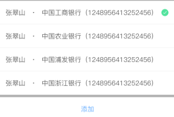
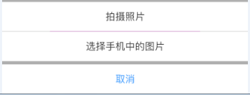
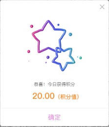
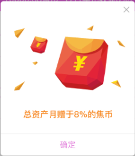
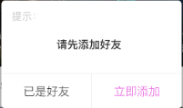
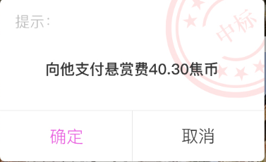

# Food
作为一个空的项目框架使用

## 我的笔记进阶篇: [点击这里](https://github.com/LJF-SH/MyNote)
仿IOS Android DiaLog项目参考:https://github.com/weavey/NormalSelectDialog

 

### 栗子： 
    
    /**
     * list弹窗 银行选择
     *
     * @param context
     */
    private void BankChangeDialog(Context context) {
        final ArrayList<String> s = new ArrayList<>();
        s.add("支付宝");
        s.add("微信");
        s.add("中国银行");
        s.add("中国工商银行");
        s.add("中国农业银行");
        s.add("中国建设银行");
        s.add("中国邮政储蓄银行");
        s.add("交通银行");
        contentItemListener = new ContentItemListener() {
            @Override
            public void onItemClick(View view, int position) {
                tvBankCenterTe1.setText(s.get(position));
                tvBankCenterTe1.setSelection(tvBankCenterTe1.getText().toString().length());
                contentAdapter.notifyDataSetChanged();
                mdialog.dismiss();
            }
        };

        contentAdapter = new ContentAdapter(context, s, contentItemListener);
        mdialog = new ListDialog.Builder(context)
                .setContentAdapter(contentAdapter)
                .setBottom("取消")
                .setCanceledOnTouchOutside(false)//点击空白不消失
                .setBottomVisivle(true)
                .build()
                .show();
    }
    
## 更多用法: [点击这里](https://github.com/LJF-SH/Food/blob/master/torontofoods/app/src/main/java/com/shenni/torontofoods/utils/DialogMaterialUtils.java)

 

 

---
都看到这里了，顺便给个。。。哎 别走啊，还没点。。。
---